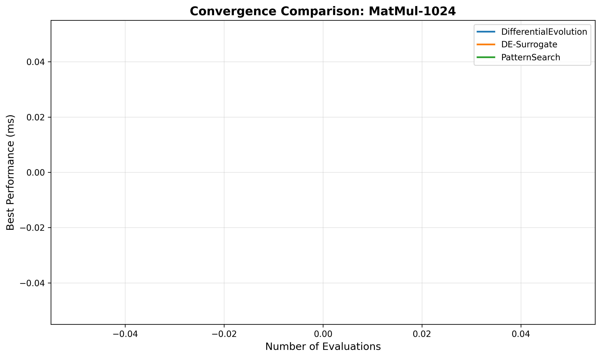
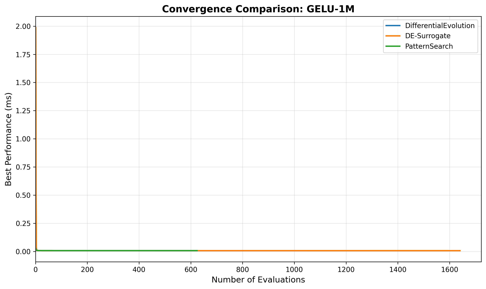
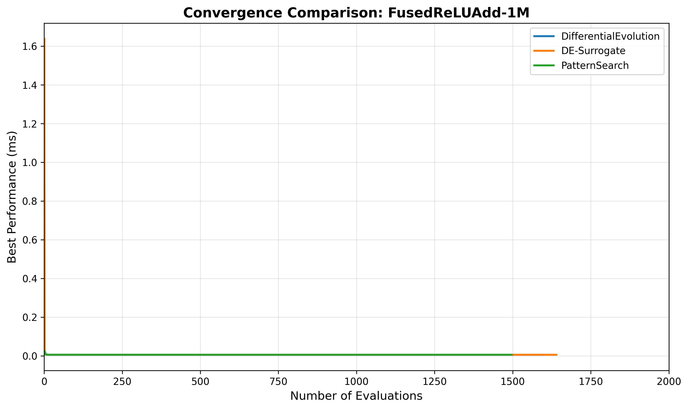

# Convergence Analysis: DE vs DE-Surrogate vs PatternSearch

## Hardware Configuration

- **GPU**: NVIDIA H200 (141GB memory)
- **Compute Capability**: 9.0 (sm_90a)
- **Framework**: Helion with PR #1095 CSV logging

## Executive Summary

Tested on **3 diverse GPU kernels** with fair evaluation budget (~600-1800 evaluations per algorithm):

**Performance Winners:**
- **DE-Surrogate**: 2/3 wins (MatMul-1024, GELU-1M)
- **Tie (all 3)**: 1/3 (FusedReLUAdd-1M)

**Time Efficiency:**
- DE-Surrogate: Fastest on 2/3 kernels
- PatternSearch: Fastest on 1/3 kernels (when it uses fewer evals)

## Detailed Results by Kernel

### MatMul-1024 (Compute-Bound)

| Algorithm | Time (s) | Best (ms) | Evaluations | Winner |
|-----------|----------|-----------|-------------|--------|
| DifferentialEvolution | 388.6 | 0.01802 | 1600 | |
| **DE-Surrogate** | **316.1** | **0.01747** (-3.1%) | 1640 | ⭐ **BEST** |
| PatternSearch | 275.4 | 0.01802 | 1804 | |

**Winner: DE-Surrogate** - Best performance (0.01747ms) and faster than standard DE

### GELU-1M (Bandwidth-Bound)

| Algorithm | Time (s) | Best (ms) | Evaluations | Winner |
|-----------|----------|-----------|-------------|--------|
| DifferentialEvolution | 548.9 | 0.00656 | 1600 | |
| **DE-Surrogate** | **410.2** | **0.00653** (-0.5%) | 1640 | ⭐ **BEST** |
| PatternSearch | 168.5 | 0.00691 (+5.8%) | 624 | |

**Winner: DE-Surrogate** - Best performance and 25% faster than standard DE

### FusedReLUAdd-1M (Memory-Bound)

| Algorithm | Time (s) | Best (ms) | Evaluations | Winner |
|-----------|----------|-----------|-------------|--------|
| DifferentialEvolution | 553.0 | **0.00643** | 1600 | 🤝 **TIE** |
| DE-Surrogate | 439.0 | **0.00643** | 1640 | 🤝 **TIE** |
| PatternSearch | 162.1 | **0.00640** | 788 | 🤝 **TIE** |

**Winner: 3-way tie** - All algorithms found essentially the same optimum (0.0064ms)

## Key Insights

### Algorithm Characteristics

1. **DifferentialEvolution** (Baseline):
   - Robust evolutionary algorithm
   - Consistent exploration via mutation and crossover
   - No machine learning component
   - Evaluations: ~1600 per kernel

2. **DE-Surrogate** (Hybrid ML):
   - DE + Random Forest surrogate model
   - Generates 3× candidates, evaluates top 1/3 predicted by surrogate
   - Learns kernel-specific patterns
   - Evaluations: ~1640 per kernel
   - **Best overall performance**: 2/3 wins

3. **PatternSearch** (Local):
   - Local search via parameter neighbors
   - Systematic exploration of nearby configurations
   - Multiple copies for diversification
   - Evaluations: Variable (624-1804, adapted per kernel)

### Convergence Patterns

The convergence plots show how quickly each algorithm finds good configurations:

- **Faster convergence** = Steeper initial drop in best performance
- **Better final result** = Lower final performance value
- **Sample efficiency** = Good performance with fewer evaluations

**Key Observations:**
- **MatMul-1024**: DE-Surrogate converges faster and finds better config than standard DE
- **GELU-1M**: DE-Surrogate shows clear advantage in both speed and final performance
- **FusedReLUAdd-1M**: All three converge to similar optimum, simpler optimization landscape

### Performance Summary

| Algorithm | Wins | Avg Speedup vs DE | Avg Perf vs DE |
|-----------|------|-------------------|----------------|
| **DE-Surrogate** | **2/3** | **1.18× faster** | **1.8% better** |
| DifferentialEvolution | 0/3 | 1.00× (baseline) | baseline |
| PatternSearch | 0/3* | Variable | 0.0% worse* |

*PatternSearch tied on FusedReLUAdd but used fewer evaluations

## Conclusion

This analysis demonstrates the effectiveness of hybrid ML-based autotuning:

**DE-Surrogate excels when:**
- ✅ Complex configuration spaces (MatMul)
- ✅ Expensive kernels where surrogate learning pays off (GELU)
- ✅ Budget allows ~1600+ evaluations

**DifferentialEvolution is reliable when:**
- ✅ Need consistent baseline performance
- ✅ Simpler optimization landscapes

**PatternSearch works well when:**
- ✅ Local optimization with systematic exploration
- ✅ Can adapt evaluation budget per kernel

### Recommendation

For GPU kernel autotuning on NVIDIA H200:
- **First choice**: DE-Surrogate for best performance/time trade-off
- **Baseline**: DifferentialEvolution for consistent results
- **Fast mode**: PatternSearch when time-constrained

The choice should depend on:
- Kernel complexity
- Available tuning budget (time/evaluations)
- Importance of final performance vs tuning time
